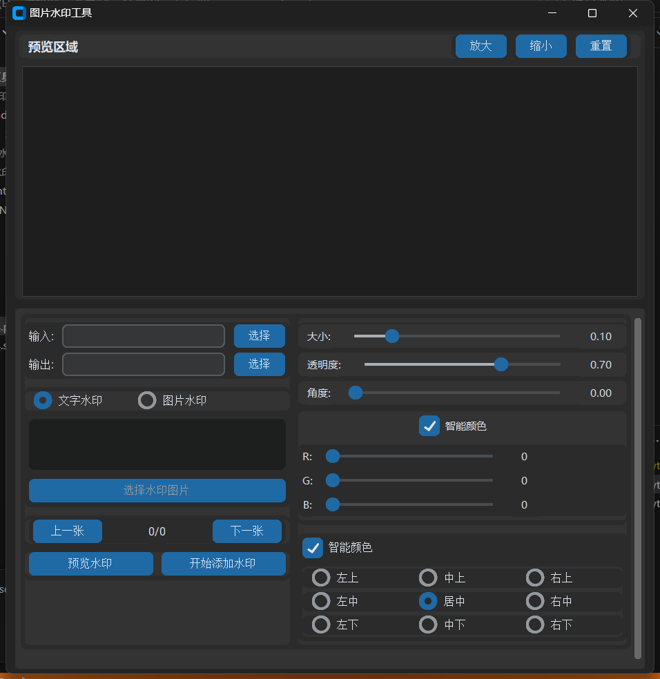

# 图片水印工具 (Image Watermark Tool)

一个现代化的图片水印工具，支持批量为图片添加文字或图片水印，具有实时预览和智能颜色适配功能。

[English](./README_EN.md) | 简体中文



## ✨ 特性

- 🖼️ 支持文字水印和图片水印
- 👀 实时预览水印效果
- 🎨 智能颜色适配
- 📦 批量处理图片
- 🎯 9种固定位置 + 自定义位置
- 📝 支持多行文本水印
- 🔄 支持水印旋转和透明度调节
- 📋 支持多种图片格式 (PNG, JPG, JPEG, BMP, TIFF, WEBP)

## 🚀 快速开始

### 安装

```bash
# 克隆仓库
git clone https://github.com/Karry-Almond/image-watermark-tool.git

# 安装依赖
pip install -r requirements.txt
```

或直接下载打包好的可执行文件：[Releases](https://github.com/yourusername/image-watermark-tool/releases)

### 使用方法

1. 运行程序
```bash
python watermark.py
```

2. 操作步骤：
   - 选择输入文件夹
   - 选择输出文件夹
   - 选择水印类型（文字/图片）
   - 调整水印参数
   - 预览效果
   - 开始处理

## 🛠️ 功能说明

### 水印类型
- **文字水印**
  - 支持多行文本
  - 自动字体大小调整
  - 智能颜色适配
  
- **图片水印**
  - 支持透明PNG
  - 保持宽高比缩放
  - 自动位置调整

### 参数设置
- 大小：1%-50%
- 透明度：0-100%
- 旋转：0-360°
- 位置：9个固定位置
- 颜色：智能适配/手动RGB调节

## 📸 预览功能

- 实时预览水印效果
- 支持预览图片切换
- 缩放和平移预览
- 自动适应预览区域

## 🔧 技术特性

- 基于CustomTkinter的现代UI
- 多线程处理避免界面卡顿
- 智能背景颜色分析算法
- 内存优化的图片处理
- 支持高分辨率显示

## 📋 系统要求

- Windows 7+
- macOS 10.12+
- Linux (GTK 3)
- Python 3.6+ (源码运行)

## 📦 依赖

```txt
customtkinter>=5.2.0
Pillow>=9.0.0
numpy>=1.19.0
```

## 🤝 贡献

欢迎提交问题和改进建议！提交PR前请确保：

1. 更新测试用例
2. 更新相关文档
3. 遵循现有代码风格

## 📄 许可证

Red_Dusk
## 🙏 致谢

- [CustomTkinter](https://github.com/TomSchimansky/CustomTkinter) - 现代化UI框架
- [Pillow](https://python-pillow.org/) - 图像处理库
- [NumPy](https://numpy.org/) - 科学计算库


## 📝 更新日志

### v1.0.0 (2024-01-20)
- 首次发布
- 支持文字水印和图片水印
- 实时预览功能
- 智能颜色适配
- 批量处理功能

如果这个项目对你有帮助，欢迎 star ⭐️
